# Real World Assets: The Bridge Between TradFi and DeFi  

# Table of Contents  

Key Takeaways 3  

Introduction 4  

Real World Assets 101 5  

What are Real World Assets? 5   
What’s the purpose of Real World Assets? 5   
How do Real World Assets work? 8   
Example: RealT Real Estate RWA 10  

# Market Analysis of the RWA Ecosystem 12  

RWA Markets 12   
RWA Underlyings 18   
Highlighted RWA Protocols & Market Participants 21   
MakerDAO 21   
Centrifuge 24   
Goldfinch 25   
Ondo Finance 27   
Maple 27  

Future Trends to Watch 28  

Layer 1 RWA Chains 28   
Regulation and Enforcement 29   
Macro vs. DeFi Environments 30  

Conclusion 31  

References 32  

# Key Takeaways  

❖ Real World Assets (“RWAs”) are assets that exist off-chain, but are tokenized and brought on-chain to be used as a source of yield within DeFi.   
❖ The potential impact that RWAs could have on DeFi seems transformative.   
❖ RWAs can offer yields to DeFi which are sustainable, reliable, and backed by traditional asset classes.   
❖ RWAs can render DeFi to become more compatible with external markets, resulting in greater liquidity, capital efficiency, and investment opportunities. RWAs allow DeFi the ability to bridge the gap between decentralized financial systems and traditional financial systems. RWAs can represent tangible assets, such as gold and real estate, as well as intangible assets, such as government bonds or carbon credits.   
❖ The main driving force behind bringing real world assets onto the blockchain is the belief that, in the long-term, DeFi will offer unique opportunities and market efficiencies to asset holders, which cannot be found in traditional financial systems.   
❖ The ability to easily fractionalize and disperse RWAs in DeFi renders previously unfractionalized, total sum, private credit investments to become accessible to a new set of investors.   
❖ Fixed income is the predominant market in the RWA space.   
❖ There are a number of topical trends that are shaping the evolution of the RWA ecosystem: layer 1 RWA protocols, regulation and enforcement mechanisms, macro environment.  

# Introduction  

Since November 2021, total value locked (“TVL”) in DeFi has fallen by over $\mathsf{U S}\Phi\mathsf{1}20\mathsf{B}$ .(1) DeFi yields have hit rock bottom, closely correlating with two-year lows in transaction volume and investor participation.(1) This plight of activity has exposed the self-reliant and recursive nature of DeFi yields. On most DeFi protocols today, investors earn yield at a rate that is based on on-chain activity (e.g. DEX transaction fees, lending protocol borrowing costs). During bull markets, when on-chain activity is high and crypto prices are rising, investors can find lucrative yields and reinvest their earnings back into DeFi, creating a positive feedback loop. However, as on-chain activity and prices drop during bear markets (like the one we are in now), a bull run can quickly reverse, leaving little to no traces of appealing yield opportunities for investors.(2)  

A new source of real yield is emerging to address this problem: Real World Assets (“RWAs”) are assets that exist off-chain, but are tokenized and brought on-chain to be used as a source of yield within DeFi. RWAs can represent many different kinds of traditional assets such as commercial real estate, bonds, cars, and almost any other store of value that can be properly tokenized and accounted for. Since the early days of blockchain technology, market participants have sought to bring RWAs on-chain. However, the most recent bear market has been an especially notable period of development and growth within the RWA space. TradFi institutions, such as Goldman Sachs, Hamilton Lane, Siemens, and KKR all have announced that they are working towards bringing their real world assets on-chain. Furthermore, protocols, such as MakerDAO and Aave, are tailoring their crypto-native platforms to become compatible with RWAs.  

The potential impact that RWAs could have on DeFi seems transformative. RWAs can offer yields to DeFi which are sustainable, reliable, and backed by traditional asset classes. Furthermore, RWAs allow DeFi the ability to bridge the gap between decentralized financial systems and traditional financial systems. This means DeFi can begin to address the sea of liquidity, opportunities, and value which exists outside the digital asset space $({\sim}{\sf U S}{\ll}1{\sf T}$ in digital assets vs. $>\!\mathsf{U S}\Phi600\mathsf{T}$ in asset value in traditional financial systems).(3) If DeFi wants to have a significant impact on how finance is conducted, a successful implementation of RWAs seems critical.  

In this report, we investigate the rapidly evolving RWA ecosystem. More specifically, we breakdown what RWAs are, how RWAs work, and the purpose behind RWAs. We additionally offer an in-depth market analysis of the RWA ecosystem and highlight major players within the RWA space. Lastly, we provide an overview of important trends and narratives to watch as the RWA ecosystem evolves.  

# Real World Assets 101  

# What are Real World Assets?  

Real World Assets (“RWAs”) are assets that exist off-chain, but are tokenized and brought on-chain to be used within DeFi.  

To bring real world assets into DeFi, the value of an asset must be “tokenized” - a process of converting something of monetary value into a digital token so that its value can be represented and transacted on the blockchain. RWAs are, in this way, simply tokens representing the value of a real world asset, which is brought on-chain so that it can be utilized on a DeFi protocol.  

Any real world asset that has a well-defined monetary value can be represented by RWAs. RWAs can represent tangible assets, such as gold and real estate, as well as intangible assets, such as government bonds or carbon credits. Below includes a non-exhaustive list of real world asset classes that can be brought onto the blockchain through the RWA vehicle.  

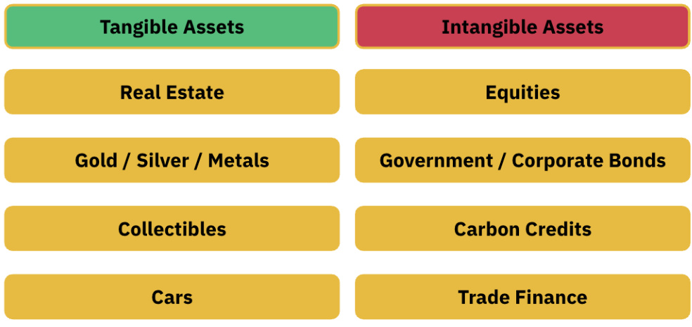  
Figure 1: Examples of real world assets   
Source: Binance Research  

# What’s the purpose of Real World Assets?  

While there are noteworthy short term catalysts accelerating the development and growth of RWAs (see the Future Trend to Watch section), the true purpose behind RWAs lies with its long term potential. The main driving force behind bringing real world assets onto the blockchain is the belief that, in the long-term, DeFi will offer unique opportunities and  

# market efficiencies to asset holders, which cannot be found in traditional financial systems.  

Over the course of history, traditional financial systems (“TradFi”) have relied on intermediation systems, consisting of middle-men, background checks, and regulations. While these intermediation systems have helped instill a certain level of security and control, they have been at the expense of optimal market efficiency and opportunities for asset holders. Market efficiency and opportunities dwindle when market participants are unwilling to pay fees to rent-seeking intermediaries, are denied access to the market by a centralized regulator, or are uncomfortable transacting in a system in which their assets are controlled by a third-party.  

Decentralized financial systems (“DeFi”) hold promise to dismantle some of the constraints found within TradFi, and in turn, deliver material improvements in regards to market efficiency and opportunities for asset holders. DeFi minimizes or completely cuts out the intermediation systems found in TradFi to effectively decentralize the back-end of financial markets. In the International Monetary Fund’s (“IMF”) 2022 Global Financial Stability Report, the IMF has found that DeFi’s nuanced approach to financial markets results in outstanding cost savings as compared to TradFi systems.(4) Savings mostly accrued from the absence of labor and operational costs, which are normally high in TradFi systems given their complex intermediary systems.  

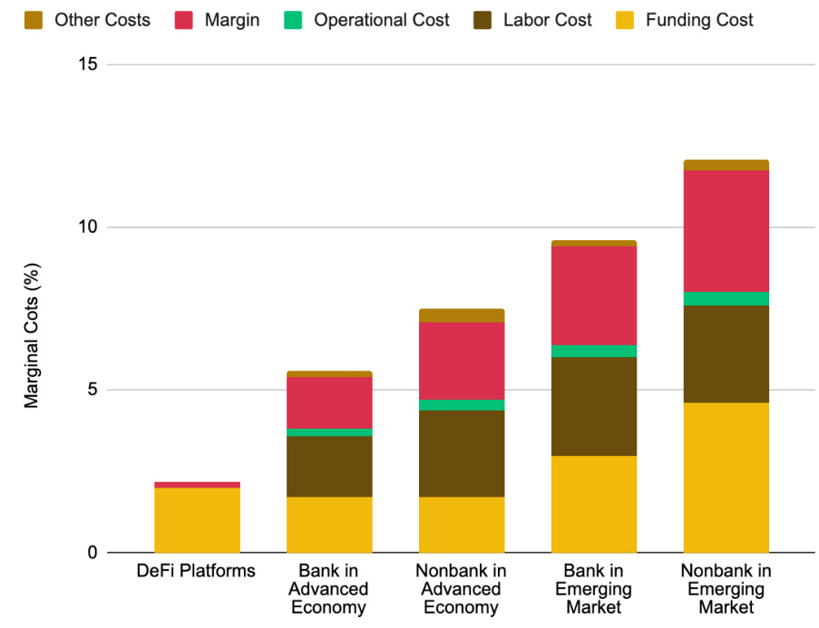  
Figure 2: Marginal Costs of Different Financial Systems   
Source: International Monetary Fund, Binance Research  

Beyond the removal of the intermediation system, idiosyncratic innovations found within DeFi have the potential to further market efficiency and bolster opportunities. For example, Automatic Market Maker (“AMM”) models allow asset holders instantaneous access to liquidity and transaction finality, which are investment dynamics not commonly found within traditional settlement systems. Additionally, within DeFi, asset holders have the ability to easily fractionalize value and distribute exposure via digital tokens. This opens up new markets and enables even smaller investors (e.g. retail) to gain exposure to assets with traditionally high investment thresholds. Lastly, the transparency of the blockchain ledger provides market participants within DeFi unique clarity into transaction flow, asset ownership, and mark-to-market prices, which tend to be hidden in TradFi systems.  

Figure 3: TradFi vs. DeFi from first principles.  

  
Source: Frigg.eco, Binance Research  

Overtime, DeFi has the potential to prove as the superior back-end for financial systems. As DeFi continues to mature and prove its viability, asset holders may desire to represent their assets via RWAs in order to access improvements in market efficiency and opportunities afforded by DeFi.  

“Whereas the internet created a better standard for how text, photos, audio, and video were exchanged, DeFi will create a better standard for how assets are exchanged.” - Teej Ragsdale for Nasdaq(5)  

# How do Real World Assets work?  

Figure 4: RWAs describe how real world assets are accounted for in a blockchain environment  

# Teej () @Lempheter  

"RWA" is just a meme to describe how the incumbent system will speak to the new one.  

Accounting for the physical in the digital.  

Source: @Lempheter on Twitter  

Thus far, we have established that RWAs are literally tokenized representations of off-chain, real world assets. However, we have not clarified how ownership and representation of those assets can be seamlessly accounted for when moving between the digital and physical realms. In this section, we breakdown how RWAs work, and more specifically, how they can be accounted for as legitimate representations of real world assets.  

The process of RWA tokens becoming legitimate bearer assets can be conceptualized as three phases: (1) Off-Chain Formalization (2) Information Bridging (3) RWA Protocol Demand and Supply.  

Figure 5: How RWA tokens become legitimate bearer assets  

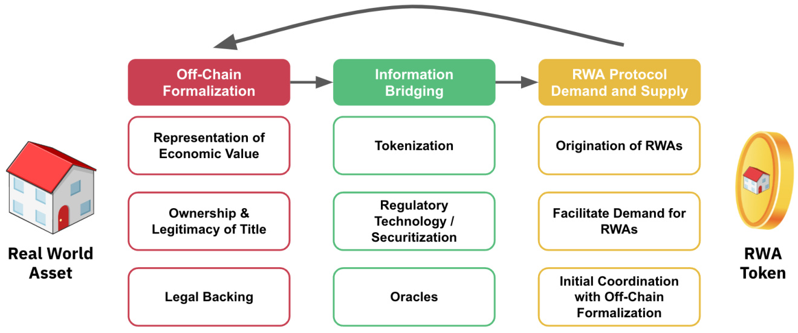  
Source: Binance Research  

# Off-Chain Formalization  

A real world asset that is to be brought to DeFi, must first be formalized off-chain so that there’s clarity in how much the asset is worth, who owns the asset, and which legal process protects any related property rights.  

Representation of Economic Value: An asset’s economic value can be represented by the asset’s fair market value in traditional markets, its recent performance data, its physical condition, or any other economic specifiers.  

Ownership & Legitimacy of Title: The ownership of an asset can be formalized by a deed, a mortgage, an invoice, or any other reflection of one’s holdings.  

Legal Backing: In the scenario where there are any legal ramifications concerning the representation $/$ ownership of an asset, there should be a well-defined resolution process. Often this includes understanding asset specific legal proceedings for liquidations, dispute resolutions, and enforcement.  

# Information Bridging  

Next, the information regarding an asset’s economic value and ownership is brought on-chain to be stored within a blockchain ledger.  

Tokenization: The information collected in the Off-Chain Formalization phase is translated into code and represented by the metadata of a digital token. This metadata can be accessed via the blockchain, providing full transparency into an asset’s economic value and ownership. As previously mentioned, this process is called “tokenization.” As shown below, there have been numerous proposals attempting to create a DeFi standard for asset tokenization.  

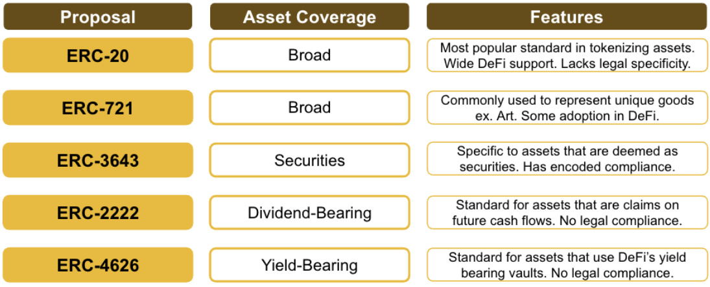  
Figure 6: DeFi standards to tokenize real world assets  

Regulatory Technology/Securitization: For assets that require some type of regulatory oversight or are deemed to be securities, there exists different regulatory technologies which serve to onboard assets into DeFi in a legally compliant way. Regulatory technologies include but are not limited to licensed security token issuers, crypto KYC/KYB providers, and cleared security token exchanges.  

Oracles: For RWAs to accurately portray the value of an asset that lives off-chain, it requires external data. Consider a share of stock represented as an RWA. DeFi needs to access the performance data of that stock, so its market value on-chain can mimic its market value off-chain. Blockchains, however, due to the Oracle Problem, are unable to pull external data directly from centralized sources (such as a stock exchange) onto the blockchain. Instead, decentralized oracles, such as Chainlink, are used to supply off-chain asset data to DeFi protocols.  

# RWA Protocol Demand and Supply  

DeFi protocols, which specialize in RWA offerings, drive this entire process; On the supply side, DeFi protocols oversee the origination of RWAs. Additionally, on the demand side, DeFi protocols facilitate investor demand for RWA opportunities. In this way, most DeFi protocols that specialize in RWAs, serve as both the starting point of new RWA originations and the marketplace for RWA end products.  

# Example: RealT Real Estate RWA  

By looking at a practical example, the three different phases required to properly convert a real world asset into a RWA become clear. Consider RealT, a platform that creates a DeFi market around fractional ownership of US real estate properties. Investors on RealT are able to obtain exposure to real estate investing, without owning the entire property. Real estate owners on RealT, can sell fractional shares of ownership in their properties to diversify away from complete ownership.  

Real World Assets: The Bridge Between TradFi and DeFi  

Figure 7: Interface of RealT, Real Estate RWA Marketplace  

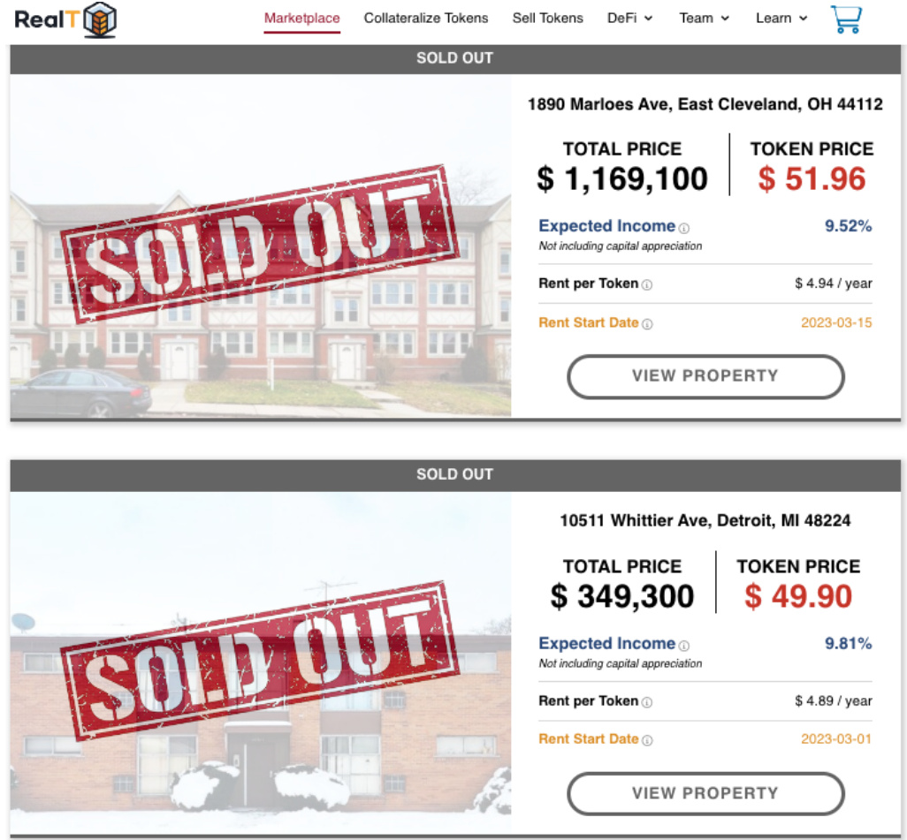  
Source: RealT  

For a US real estate property to become converted into a RWA digital token, the property’s value must first be formalized off-chain. Each residential property that RealT tokenizes as an RWA, has a third-party property valuation, a deed representing ownership, and a well-defined process in the case that a tenant does not pay rent or the house must be foreclosed.  

Next, information regarding the property will be bridged to the blockchain. More specifically, a property’s information must be tokenized, securitized, and transmitted through oracles. RealT does not tokenize the physical asset, but rather tokenizes shares in an LLC which owns the deed to the property under the ERC-20 standard. On the securitization front, RealT files under US securities law exemption D & exception S and has accompanying KYC technology built into the protocol to legally onboard investors and sellers. Lastly, RealT uses oracles to provide property fair market value to its DeFi application.  

RealT originates RWAs and proceeds to list new RWA offerings on their protocol. RealT has sold out on a number of offerings, and must meet investor demand with new RWA originations.  

# Market Analysis of the RWA Ecosystem  

DeFi markets that offer exposure to RWAs are flourishing. There is growing diversity in both the types of markets that are being offered as well as the types of underlying assets that are being represented by RWAs. Furthermore, there is increased engagement from both crypto-native and TradFi companies in these DeFi markets. In this section, we provide market analysis of the RWA ecosystem and additionally, highlight major protocols and participants who are shaping RWA markets.  

# RWA Markets  

There exists a diverse set of markets that surround the RWA asset class. In DeFi today, RWAs serve as the primary instrument for equity based DeFi markets, real asset based DeFi markets, and fixed income based DeFi markets.  

Figure 8: Varied markets surrounding RWA Instruments  

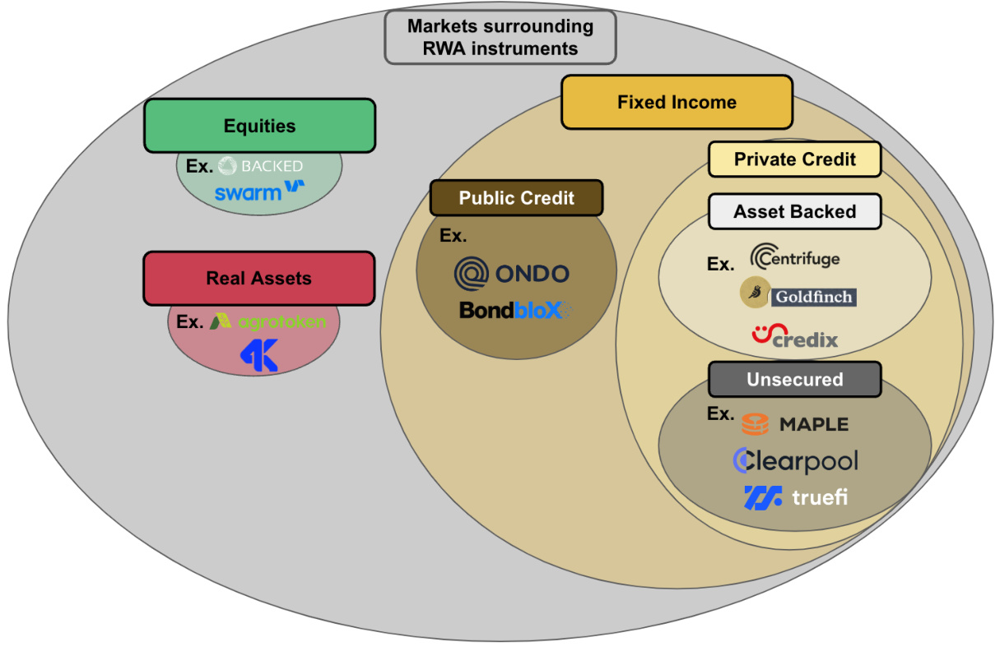  

# Equity and Real Asset Markets  

Equity and real asset markets in the RWA space are relatively small, with few protocols currently building in the space. One reason for this may be that equities or real assets (such as commodities) are typically traded in public markets, and as a result, are heavily regulated. In most jurisdictions, public equities and real assets can only be offered by registered and scrutinized exchanges. Another reason for this is because equity and real asset instruments often entail off-chain physical ownership in the underlying asset class. This adds a layer of operational complexity as equity/real asset protocols are not simply facilitating financial contracts on paper, but actually must store the equity/real asset and have the ability to transfer ownership of the equity/real asset in the case of a redemption. For example, Backed Finance, one of the few protocols that offers public equity RWAs, is required to be registered under the Swiss-DLT act, and must back every RWA asset fully with ownership over underlying stocks. In the case of the redemption, Backed Finance must sell the user's stock holdings, and then coordinate if they would like to be reimbursed in cash or crypto.(6) Lastly, DeFi derivative and synthetic (contractual, non-ownership) based markets, such as Synthetix, have been established within crypto for a long time, serving as an entrenched alternative to equity/real asset RWA markets.  

# Fixed Income Markets  

Fixed income is the predominant market in the RWA space. In comparison to the equity or real asset markets, RWA based fixed income markets are more active in terms of transaction flow, rich in terms of offerings, and diverse in terms of market participation. As shown in Figure 8, fixed income markets offer both private and public credit offerings.  

Private credit based RWAs offerings are abundant within DeFi. In fact, private credit offerings have comprised over $\mathsf{U S}\Phi\mathsf{4B}$ in total loan value across 1,560 different loans. The ability to easily fractionalize and disperse RWAs in DeFi renders previously unfractionalized, total sum, private credit investments to become accessible to a new set of investors. This unique innovation in the private credit space has notably attracted non-traditional borrowers and investors. Borrowers are able to benefit from private credit based RWAs because they are able to reach a new market of lenders through fractionalization and the lowering of liquidity barriers. DeFi investors are able to gain exposure to private credit markets which, in the TradFi space, have been traditionally reserved for credit funds and other institutions with access to large sums of capital and private connections.  

Real World Assets: The Bridge Between TradFi and DeFi  

Figure 9: Private Credit RWA Market Metrics  

  
Source: RWA.xyz, Binance Research  

During May 2022, the total active value of private credit loans across all RWA protocols, reached an all time high of over ${\sim}\mathsf{U S}\Phi\mathsf{1.4B}$ . However, since May 2022, total active loan value and new issuance in the private credit space has declined in correspondence with the broader market. Today, total activeloan value is down by over $-75\%$ from the January highs of $\mathsf{U S}\mathbb{5}\mathbb{1.4B}$ and now sits ${\sim}\mathsf{U S}\Phi320\mathsf{M}$ as of February 28, 2023. Similarily, new issuance was highest in October 2021 with $\mathsf{U S}\Phi458$ issued as compared to only $\mathsf{U S}\Phi40\mathsf{M}$ issued in February 2023.  

Figure 10: Private Credit total loan value outstanding and new issuance have fallen steeply  

  

The average interest rate that borrowers must pay on these RWA-collateralized loans is $9{-}9.75\%$ . This is a relatively high rate, given that currently, the average business loan ranges from $4.90\%$ to $9.83\%$ at TradFi banks.(7)  

  
Figure 11: Interest rate distribution of private credit loans  

There are a number of protocols that make up RWA private credit markets. These protocols can be segmented into two groups: whether they offer asset-backed (or secured) private credit, or unsecured private credit (undercollateralized or not collateralized).  

Asset-backed private credit protocols, such as Centrifuge, Goldfinch, or Credix, orchestrate private credit markets in a way that is familiar to DeFi; just like any other crypto native lending/borrowing protocol, a borrower chooses a crypto asset to borrow, deposits collateral, and makes interest payments to liquidity providers. The only distinction between crypto native lending/borrowing protocols and asset-backed RWA private credit protocols is that the collateral posted is not crypto, but rather a real world asset, such as a real estate property, an or any other kind of RWA.  

By allowing borrowers to secure their loans with RWAs instead of crypto, asset-backed protocols have unlocked access to cryptocurrency capital for most businesses and institutions in the world. Asset backed DeFi protocols have been extremely beneficial to borrowers who lack access to traditional financial markets or a stable store of value in their countries’ native fiat currency. As shown below in Figure 11, most of the loans taken out on asset-backed private credit protocol Goldfinch, are from emerging market economies. For an emerging market business/institution, whose native currency is subject to frequent devaluation, a cryptocurrency or stablecoin denominated loan can provide greater stability and predictability than a fiat denominated loan from their TradFi bank.  

Figure 12: The majority of private credit loan exposure from Goldfinch is in Emerging Markets  

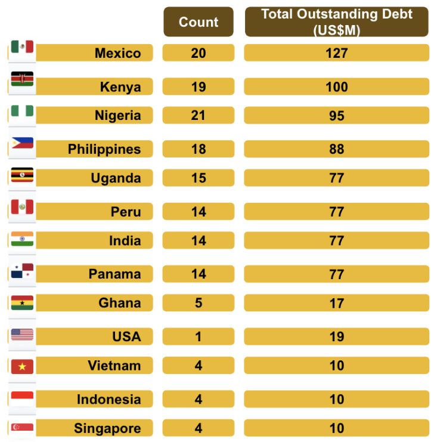  

Unsecured private credit protocols, on the other hand, significantly differ from crypto native protocols. Since the early days of DeFi, crypto native borrowing/lending protocols, such as Aave and Venus, have required that borrowers deposit enough crypto collateral so that the value of their collateral exceeds the value of their loan (a.k.a “overcollateralization”). Overcollateralization is in line with DeFi’s decentralized and trustless ethos; borrowers do not need to submit any proof of identity or credit score because even if they default on their interest payments, lenders are programmatically insured (by smart contracts) to be made whole from the initial overcollateralization deposit. While overcollateralization allows crypto native protocols to more easily manage counterparty risk amongst a decentralized/trustless system, it discriminates against borrowers who are unable to meet the collateralization threshold and ultimately, reduces capital efficiency within the market. For example, for any large company and institution, who require sizable credit lines, overcollateralization is operationally infeasible and adverse to financial performance.  

In attempts to improve capital efficiency within DeFi and enable underserved borrowers, unsecured RWA based private credit protocols have come to market. Protocols such as Maple, Clearpool, and TrueFi are redefining crypto lending/borrowing protocols by removing overcollateralization requirements. Instead, these protocols pride themselves on allowing cleared business/institutions to borrow cryptocurrency while being undercollateralized with RWA assets or depositing no RWA collateral at all.  

In order to move away from overcollateralization, these protocols have had to implement centralized background checks, due diligence procedures, and credit checks for any person/entity who wants to borrow/lend off their protocol. For borrowers, this means submitting an application that describes the borrower’s financial background and communicating with a team of the protocol’s underwriters, who deem if the borrower is fit to borrow off their protocol. Borrowers on these protocols are mostly large institutions who require sizable credit credit lines. They are often willing to engage in deep due diligence processes to surpass the overcollateralization requirements on other DeFi protocols. Alternatively, for lenders, due diligence includes background checks that reveal one’s identity, geographic location, and finances. After this information is collected, users are granted a whitelisted wallet, which can interact with DeFi applications on-chain.  

Figure 13: Unsecured lending protocols (ex. TrueFi) require whitelisted wallets to lend capital  

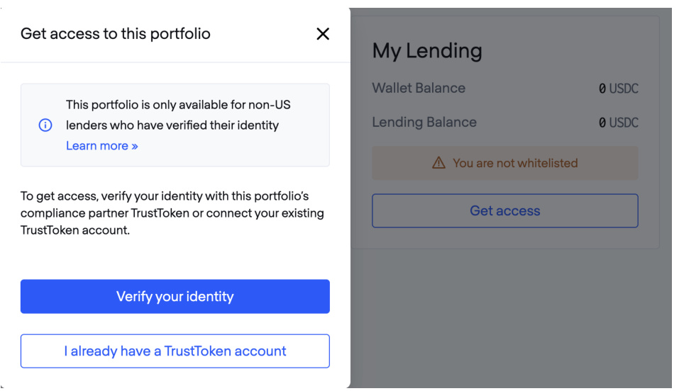  
Source:TrueFi,Binance Research  

DeFi maximalists argue that since unsecured lending protocols require centralized KYB/KYC evaluations, they are incompatible with DeFi. However, it should be recognized that despite their preference towards centralized borrower evaluations, these protocols still incorporate many DeFi primitives, such as using liquidity pools to operate debt offerings, smart contracts to automate distribution of interest payments, and blockchains to make borrowing/lending dynamics completely transparent.  

Another recent concern raised within the latest bear market, has been widespread fallout of unsecured crypto lending institutions. It should be recognized that this fallout does not represent the broad-scoping, blanket failure of the unsecured lending protocol model, but rather a failure of unsecured lending firms who failed to properly evaluate risk. In the future, RWA unsecured lending protocols can offer an essential lending market to non-crypto native firms and businesses, as long as risk management, due diligence, and legal measures are present to shield the broader crypto industry from contagion.  

Beyond private credit offerings, there are also public credit offerings available in the RWA based fixed income markets. The public credit market currently has less activity as compared to the private credit market. This is most likely for the same reasons described for the lack of activity in the public equity/real asset markets; for a protocol to offer a tokenized form of a public instrument, they must meet strict regulatory guidelines and be cleared to offer such products. However, while there is still less activity as compared to their private credit counterparts, a number of public credit protocols are building in this space. Take for example, Ondo Finance, which has announced three separate RWA funds that track US treasuries, investment grade corporate bonds, and high yield corporate bonds, or BondBlox, which currently offers 57 different RWA corporate bonds.Protocols, like Ondo Finance and BondBlox, have been willing to rise to the demands of regulatory scrutiny, to offer public fixed income products to DeFi. An opportune global rise in interest rates and increased demand for relatively safe, public fixed income products, has perhaps bolstered a willingness for public fixed income protocols to come to market and reach the high bar set by regulation. In the Future Trends to Watch section, we discuss how influential regulation is to the RWA space and more specifically, how regulation specific to digital assets will shape the space in the future.  

A number of RWA public credit offerings are also coming from governments. While these tend much more towards the TradFi side of the spectrum rather than the DeFi end, they should be recognized as a significant offering in the RWA markets. For example, El Salvador is planning to use RWAs to represent investment into a planned $\mathsf{U S}\mathbb{S}\mathbb{1B}$ bond offering.(8)Additionally, Israel’s Ministry of Finance and the Tel Aviv Stock Exchange has already completed live tests for its tokenized digital bonds.(9)  

# RWA Underlyings  

As mentioned previously, there are a number of different underlying assets that RWAs represent.  

Fiat-based stablecoins are the original and by far the most notable underlying instrument for RWAs. Stablecoins are a type of crypto asset that aims to keep its price pegged to the market value of an external asset, typically fiat-currencies. Since the first stablecoins in 2014, stablecoins have increasingly become the foundations of the crypto markets, serving to provide an on/off-ramp into DeFi, price stability on-chain, and a familiar means of exchange.  

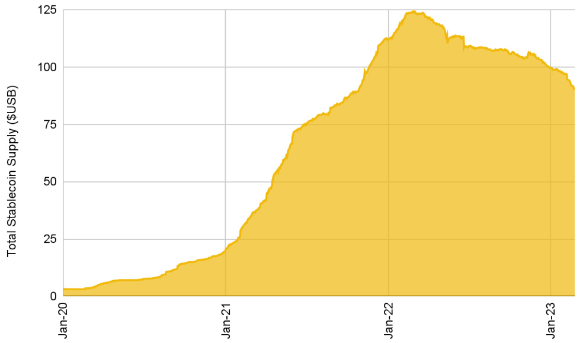  
Figure 14: Stablecoin supply in US\$ has grown significantly   
Source: Dune Analytics (@KARTOD), Binance Research  

Real World Assets: The Bridge Between TradFi and DeFi  

There are three different types of stablecoins: fiat-backed, algorithmic and crypto-overcollateralized. Fiat-backed is the most pure form of a RWA, as organizations issuing a fiat-backed stablecoin, must store real fiat currency or a fiat-equivalent off-chain. To compete in a competitive stablecoin market, fiat-backed currencies must be able to be fully redeemable and collateralized in a way that allows it to be flexible with market demand. Algorithmic, and Crypto-overcollateralized stablecoins, unlike their fiat-backed counterparts, maintain a stable peg to the dollar by manipulating the reserves of non-fiat currency (usually crypto assets). Fiat-backed stablecoins make up most of the stablecoin market cap today.  

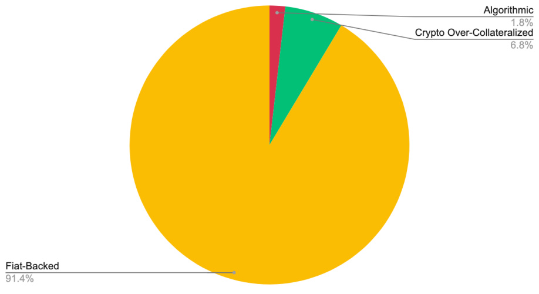  
Figure 15: Fiat-backed RWAs currently dominate the stablecoin market   
Source: Dune Analytics (@KARTOD), Binance Research  

It should be noted that operationally, fiat-backed stablecoins have experienced friction in their bridge from the real world to DeFi. Outspoken critics of fiat-backed stablecoins have raised concerns about the centralization of the stablecoin issuer (e.g. custody, issuance, redemptions) and permission controls for regulatory compliance (e.g. KYC/AML checks, on-chain blacklists) remain. Furthermore, critics highlight that fiat-backed stablecoins are not always backed in the fiat currency alone, but in part with other assets as well, including cash equivalents (e.g. US treasuries, commercial paper), secured loans, corporate bonds, and more.(10)  

Nonetheless, fiat-backed stablecoins as RWAs are foundational to DeFi and serve to enhance functionality of fiat currency, allowing stores of value to become digital, programmable, compatible, and atomically settled. Overtime, fiat-backed stablecoins will attempt to improve how they bridge between the real world and DeFi. As we will discuss in the Future Trends to Watch section, the RWA process must continue to improve in terms of transparency and reporting.  

Beyond stablecoins, the asset class which serves as the most popular underlying for RWAs is real estate. This is followed by climate-related underlyings (e.g. carbon credits) and public bond/stock underlyings. Next, emerging market credit (mainly corporate debt) underlyings and so on.  

Figure 16: Non-stablecoin protocols segmented by RWA underlying  

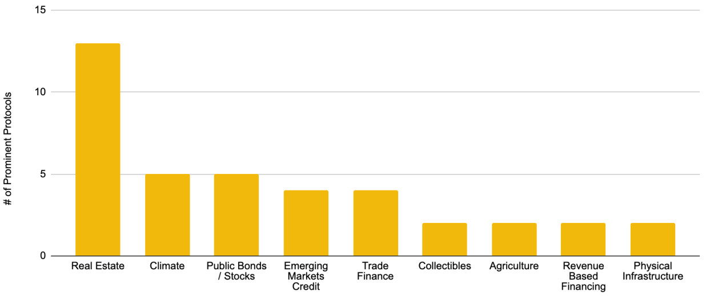  
Source:Unreal RWA Primer,BinanceResearch  

Figure 17 depicts a non-exhaustive, yet relatively comprehensive industry map of RWA protocols segmented based on the type of underlying they tokenize.  

Figure 17: RWA industry protocol map, segmented by underlyings  

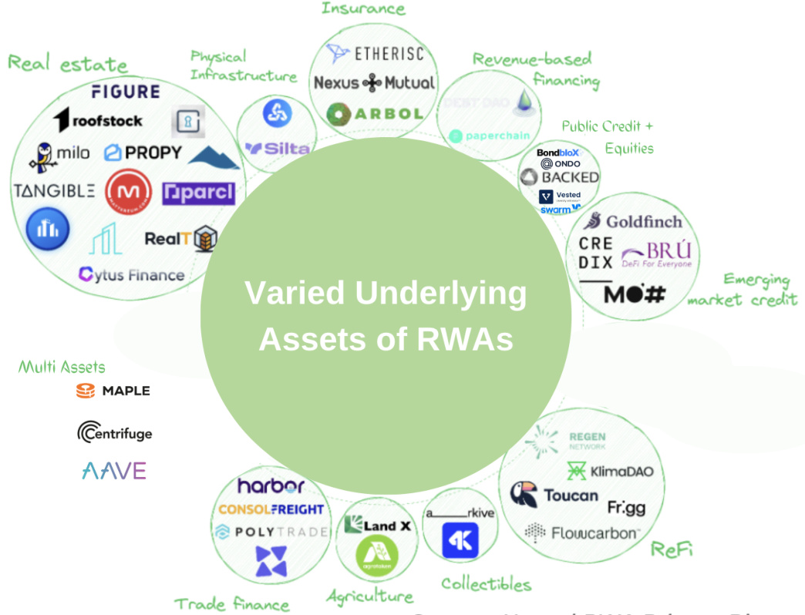  
Source:Unreal RWA Primer, Binance Research  

# Highlighted RWA Protocols & Market Participants  

In the following section, we highlight some of the major protocols and market participants engaging in the RWA ecosystem.  

# MakerDAO  

MakerDAO is a collateralized debt platform on Ethereum that has arguably made the most progress in terms of RWA adoption.  

MakerDAO allows borrowers to deposit collateral assets into “vaults” so that they can take out debt denominated in the protocol’s native ${\sf U S}\Phi$ -based stablecoin, DAI. Vaults are simply smart contracts, which hold the borrower’s Ethereum-based collateral until all the borrowed DAI is returned. As long as the value of the collateral remains above a specific threshold, the borrower will have complete control over their collateral. However, if the value of the collateral drops to become undercollateralized, the vaults will automatically liquidate the collateral through an auction process, so that the loan can be repaid in a trustless manner.  

  
Figure 18: MakerDAO lending operations   
Source: Binance Research  

The types of collateral that can be used by borrowers is determined by the protocol’s governance DAO, MakerDAO. In 2020, MakerDAO voted to allow borrowers the ability to post RWA based collateral to vaults. In addition to this vote, MakerDAO elected to fund oracle development, so that the value of RWA-based collateral on the platform could be seamlessly priced with the collateral’s value off-chain.  

Today, the value of MakerDAO’s RWA vaults is over $\mathsf{U S}\Phi680\mathsf{M}$ . This means that through RWA backed loans, MakerDAO has been able to scale the amount of DAI issued into the market. Furthermore, this means that there is ${\mathsf{U S}}\Phi6{\mathsf{80}}{\mathsf{M}}+{}$ worth of RWAs helping maintain MakerDAO’s $\mathbb{S}1$ peg stability.  

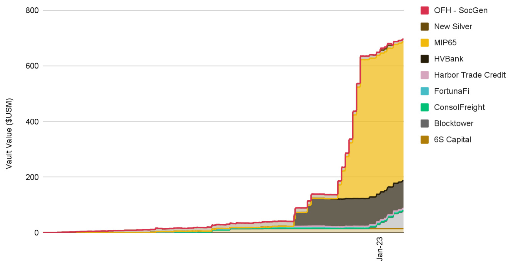  
Figure 19: RWA based vaults on MakerDAO   
Source: Dune Analytics (@SebVentures), Binance Research  

Furthermore, MakerDAO has benefited from the interest revenue paid by RWA vault borrowers. While MakerDAO’s overall revenue has decreased over the past year due to a downturn in the crypto markets, RWA vault revenues has been a brightspot. RWA vaults generate an annualized $15\Phi23M$ of revenue for MakerDAO.  

In fact, 56.7% of MakerDAO’s annualized revenue come from RWA vaults, even though RWA vaults only account for ${\sim}23\%$ of debt on the platform.(11)  

Real World Assets: The Bridge Between TradFi and DeFi  

Figure 20: RWAs account for more than half of MakerDAO’s annualized revenue  

  
Source: Dune Analytics (@Steakhouse), Binance Research  

A number of different institutional borrowers have originated RWA collateralized vaults on MakerDAO. Their capital allocation plans for the debt is varied.  

Figure 21: Different borrowers from MakerDAO’s RWA collateralized vaults  

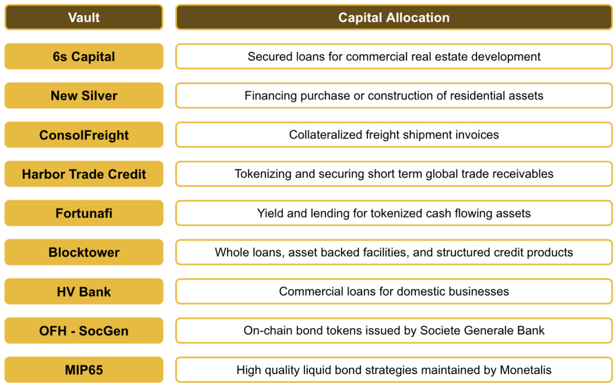  

The majority of MakerDAO’s RWA collateral $({\sim}\mathsf{U S}\Phi500\mathsf{M})$ comes in the form of US treasury bonds managed by Monetalis (MIP65). MakerDAO also launched a vault backed by $\mathsf{U S}\mathbb{5}\mathsf{1}00\mathsf{M}$ worth of loans originating from a community bank in Philadelphia called Huntingdon Valley Bank (“HV Bank”). HV Bank used MakerDAO to support the growth of its existing businesses and investments around real estate and other related verticals, and served as the first commercial loan participation between a US-regulated financial institution and a decentralized digital currency protocol. In a separate vault, French multinational banking giant, Société Générale borrowed $\mathsf{U S}\mathbb{S}7\mathsf{M}$ from MakerDAO in a position backed by €40M worth of AAA-rated tokenized bonds.(12)  

# Centrifuge  

Centrifuge is a DeFi protocol for structured credit. In TradFi, structured credit involves securitizing and pooling similar debt obligations and selling off the resulting cash flows. Centrifuge mimics this TradFi process in DeFi, and uses the resulting securities as collateral so that borrowers can obtain crypto-denominated debt. Centrifuge has helped facilitate debt pools collateralized by structured credit assets such as pooled mortgages, invoices, microlending, consumer finance, and others. Centrifuge aggregates all of its different debt offerings into a decentralized marketplace for RWA pools, which is called Tinlake. Overall, you can think of Centrifuge protocol as offering a turnkey solution for structured credit tokenization and loan origination. This streamlined approach has made Centrifuge a top choice for real world businesses looking to originate crypto loans.  

What is particularly notable about Centrifuge, is that it was one of the first protocols to integrate tranching natively into its contracts. Tranching in TradFi, allows investors to access different kinds of risk exposures and yields on the same asset class. In the case of a default, more senior tranches are paid first, hence, they have less risk and yield less than a junior tranche. Centrifuge has created structures to allow investors access to tranches on a particular Tinlake debt offering. Centrifuge currently offers two different tranches to debt offerings: senior exposure, which is represented by a token called DROP, and junior exposure, which is represented by a token called TIN.  

Centrifuge also stands out in the RWA space for its impressive network of crypto and TradFi partners. On the crypto side, Centrifuge has integrated with MakerDAO and Aave, so that debt offerings could access the liquidity of MakerDAO and Aave’s entrenched liquidity pools. Furthermore, Centrifuge RWA pools are already backing the DAI stablecoin, and is currently petitioning to back the Aave’s GHO stablecoin in the future.(13) On the TradFi side, Centrifuge has onboarded into DeFi a number of notable financial institutions who are looking to issue debt. For example, in December 2022, Centrifuge announced a launch of a $15\Phi220\mathsf{M}$ fund with  

MakerDAO and BlockTower Credit. This stands to be the largest on-chain investment in RWAs to date, and marks the first institutional credit fund to bring their collateralized lending operations on chain.(14)  

# Goldfinch  

Goldfinch is a protocol that helps businesses, primarily emerging-market based, access crypto lending without having to post crypto collateral. Instead, loans are collateralized with RWAs. By allowing loans to be collateralized with RWAs instead of crypto, Goldfinch allows almost any business to obtain crypto loans. As noted earlier, a crypto-denominated loan can be extremely beneficial to an emerging market business if their native country does not have adequate financial infrastructure, or if their native currency is susceptible to debasement.  

Goldfinch currently has originated over $15\Phi\bot20\mathsf{M}$ of RWA based loans to emerging market businesses.  

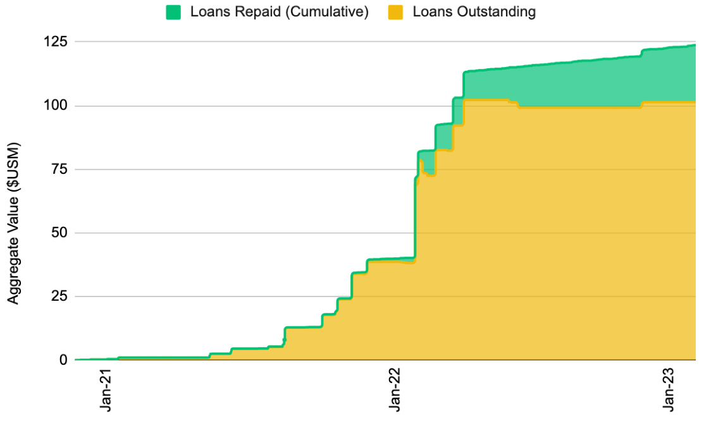  
Figure 22: Over US\$120M of RWA loans have been originated on Goldfinch   
Source: Dune Analytics (@goldfinch), Binance Research  

Goldfinch has a unique way of vetting which businesses can become borrowers on their platform. So-called “auditors" are users on the Goldfinch platform that stake the Goldfinch native token, GFI, so that they can cast a vote on whether a borrower should be able to open a credit line on Goldfinch or not. Auditors are instructed to vote based on their perception of a borrower’s creditworthiness. When auditors vote with the consensus, they are awarded GFI tokens. Once a borrower has been verified by auditors to extend credit, their proposed deal terms for the credit lines will be structured into a DeFi borrowing/lending pool.  

Next, investors can choose how they want to allocate capital. Similar to Centrifuge, there is a seniority structure within Goldfinch debt offerings. Goldfinch investors can allocate capital to individual pools (to become “backers”), or indirectly by automatically allocating capital across the entire protocol. By allocating to an individual pool, a backer is willing to invest in a more risky, first-loss junior tranche. By allocating liquidity across the protocol, an investor’s funds are diversified and deemed by the Goldfinch protocol to be “senior” to the first-loss capital of backers. Thus far, Goldfinch’s within loan book there has been no defaults / bad debt.  

Figure 23: Goldfinch borrowing/lending process  

  
Source: Goldfinch, Binance Research  

The Goldfinch protocol earns revenue through withdrawal fees from investors and backers as well as $10\%$ of the interest payments as protocol reserves.(15) Since inception the protocol has generated ${\mathsf{U S}}{\mathsf{\Phi}}_{1.6}{\mathsf{M}}_{+}$ in revenue.(16) Goldfinch maintains a business model that is not reliant on crypto markets, and has proven the  ability to be counter-cyclical.(15)  

# Ondo Finance  

Ondo Finance is bringing institutional grade products ranging from government bonds to high yield bonds to DeFi. To do this, Ondo has created three different investment funds, OUSG (Short-term US Government Bond Fund), OSTB (Short-term Investment Grade Bond Fund), and OHYG (High-Yield Corporate Bond Fund), which own the underlying institutional assets. They then tokenize these investment funds to become RWAs (called “fund tokens”). After users engage in a KYC/AML process, they are able to trade fund tokens and use those fund tokens in permissioned DeFi protocols.  

Ondo Protocol is particularly noteworthy because, with Bondblox, it is one of the few protocols building out the public credit RWA market. Allowing access to public credit on the blockchain, means that blockchain users who have a significant amount of capital on-chain, can keep it on chain, while earning a return outside of crypto, in relatively safer fixed income products. This service has become highly demanded as a means of on-chain cash management, as real DeFi yields have decreased and interest rates have increased in the public credit markets.  

# Maple  

Maple is an uncollateralized borrow/lending protocol. Unlike Goldfinch’s community-determined underwriting mechanism, Maple hosts “pool delegates” which are credit professionals that rigorously assess creditworthiness, set loan terms with borrowers, and actively manage loan books. Otherwise, the borrowing/lending process is standard. Maple LPs allocate capital to permissioned liquidity pools and receive back MPL interest.  

While Maple protocol previously focused on uncollateralized lending to crypto native firms, it is increasingly venturing into more RWA based loans. Previously, uncollateralized crypto lending to crypto trading firms, left Maple with $15\Phi52M$ in bad debt and up to $80\%$ losses for select Maple LPs. These losses came after last year’s centralized contagion spread to Maple’s crypto-native borrowers. In efforts to diversify their offerings, Maple’s pool delegates are looking to originate loans with real world asset collateral, instead of crypto collateral. For example, in January, Maple created a $\mathsf{U S}\mathbb{1}00\mathsf{M}$ liquidity pool that are backed by tax receivables.(17)  

# Future Trends to Watch  

# Layer 1 RWA Chains  

One trend to watch as the RWA ecosystem evolves is the emergence of RWA based layer 1s. Currently, the most popular RWA protocols are applications which are deployed on top of permissionless layer 1 blockchains such as Ethereum and BNB. Chain. While there are benefits to deploying to a permissionless blockchain, such as ease of development and crypto-native network effects, there are also operational and technical downsides.  

Structurally, permissionless blockchains were made to be public, not to be restrained by any kind of regulatory or permissioned logic. Many RWA protocols, especially those which are bringing securities or credit based assets to the blockchain, are required to follow regulations and constrain the usage of their protocol to entities who have undergone a strict KYC/KYB process. The permissioned nature of these RWA protocols structurally misaligns with the public, free-floating access that permissionless blockchains offer. As a result, current RWA protocols have resorted to gum-and-stick solutions to restrict access to their platforms and comply with regulations (e.g. manually whitelisting wallet addresses, restricted frontends, token-gated account access).  

Operationally, established token standards and transparency of permissionless blockchains may be inappropriate in the context of RWA protocols. Token standards on permissionless blockchains, allow smart contracts of DeFi applications to be developed and run effectively. However, these conventions can be restricting, and operationally, often cannot represent the idiosyncrasies of real world assets. For example, if a corporate bond has a balloon payment at expiration and is to be tokenized into a RWA, current token standards may not be able to capture the arbitrary payment logic of this type of asset. Furthermore, all operations and transactions on permissionless blockchains are by definition transparent and can be reviewed on a public ledger. For certain RWA markets, there may be sensitive information that should be kept confidential. For example, if a real estate property is to be represented as an RWA, the person selling the property or the person buying the property may not want to disclose the exact location for privacy purposes.  

In response to the structural and operational restraints, custom-built layer 1s are being developed to cater to the unique, permissioned demands of RWA protocols. For example, Inatain Markets recently launched an Avalanche subnet which is specifically designed for the permissioned on-chain issuance and trade of asset-backed securities.(18) Another example is Provenance blockchain, which is a layer 1 that is purpose-built to seamlessly and securely issue, transact, and service digitally-native financial assets at scale.(19) As the RWA space continues to evolve, it will become more clear if the structural and operational features of custom-built, permissioned layer 1s are more adept to handle the RWA protocol use cases.  

# Regulation and Enforcement  

RWAs are innovative in the way they are able to bridge TradFi with DeFi. However, for this bridge to be viable in the long term, clarity around regulation and enforcement measures of RWAs must catch up with the innovations that have been made. This will be a critical trend to watch for space.  

In most countries today, there exists a lack of clear regulation to govern the tokenization and securitization of real world assets. Only a few countries such as Switzerland (which recognizes digital assets as bearer assets) and France (which has adopted the CAST Framework, a hybrid between using the underlying blockchain as a settlement while keeping an off-chain register), have meaningful regulation that clarifies how a protocol should bring a real world asset to the blockchain. Further regulatory clarity will facilitate continued development and innovation in the space.  

Furthermore, enforcement mechanisms that protect the value of RWA are not well-established. Consider a scenario in which a borrower defaults on their loan and must liquidate their RWA collateral to pay back the lender. Given that the collateral is not liquid ERC-20 tokens, the liquidation of these assets to recoup lender capital could prove to be far more cumbersome than loans with crypto collateral. An alternative liquidation process that serves the lenders must then be employed. Additionally there must be an off-chain, and legally tied enforcement mechanisms of making sure this liquidation process is handled optimally for borrowers.  

Within the next year, there is a sizable amount of debt that is due to mature. Take for example the private credit space - over the next few years, a large amount of debt is set to mature. In the next month alone, an expected $15\Phi15\mathsf{m m}$ of loans are due.  

Real World Assets: The Bridge Between TradFi and DeFi  

# BINANCE RESEARCH  

Figure 24: Outstanding private credit loans to be repaid  

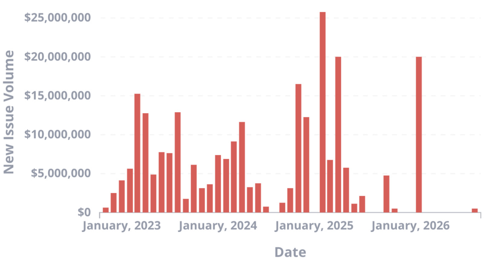  
Outstanding Loan Maturity Profile   
Source: RWA.xyz, Binance Research  

There have already been a few cases of bad debt on RWA protocols (e.g. Two pools on Centrifuge undergoing off-chain resolution, Auros on Maple, resolved through off-chain liquidation). To minimize the contagion of bad debt, it is important to establish regulation and enforcement mechanisms that will liquidate borrower’s collateral and optimally serve lenders.  

# Macro vs. DeFi Environments  

While the driving motivator for many protocols building in the RWA space is the long term promise of DeFi, RWA interest in the short term has been catalyzed by rising macroeconomic interest rates, and the fall of real DeFi yields. A bear market plight of declining prices, falling crypto yields, and an increase of protocol hacks within DeFi has increased attention towards more lucrative and potentially more sustainable yields outside of DeFi. DeFi native investors have eagerly sought to engage in a globally rising interest rate environment. As such, protocols have accelerated development of RWA offerings to meet the demand of these investors and bridge the gap between TradFi and DeFi. As the macroenvironment fluctuates, it will be noteworthy to watch how development, interest,  and offerings in the RWA space respond.  