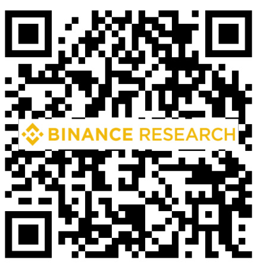

# Conclusion  

In conclusion, RWAs are truly becoming the bridge between TradFi and DeFi. Short term phenomena, such as rising macro interest rates, as well as long term driving motivators, such as the efficiencies and opportunities found within DeFi, are catalyzing the development of the RWA ecosystem. For the first time, real world, traditional assets such as bonds, real estate, carbon credits, etc, are being brought onto the blockchain.  

As time goes on, DeFi native protocols and TradFi institutions will continue to build out the RWA ecosystem. An increasing number of DeFi and TradFi entities appear to recognize the numerous benefits that DeFi and more specifically RWAs provide, such as tokenization, ease of distribution, and transparency.  

While the thought of a bridge between TradFi and DeFi is exciting, it should be recognized that the bridge can only be made viable through seamless legal, operational, and structural coordination between the physical and digital realms. This type of coordination requires seamless information exchange and well-defined processes in the case of fault either in DeFi or in TradFi.  

More broadly, the RWA narrative is particularly notable for the crypto space as it serves as an example between a more interconnected world. No longer is DeFi isolated from the real world and TradFi. Blockchain is increasingly having real world use cases and proving its worth as a transformative technology.  

# References  

1) https://defillama.com/   
2) https://blockworks.co/news/what-are-real-world-assets-defis-newest-yield   
3) https://research.thetie.io/real-world-assets/#Credit_Protocols   
4) https://www.imf.org/en/Publications/GFSR/Issues/2022/04/19/global-financial-stability-report -april-2022   
5) https://www.nasdaq.com/articles/defis-role-in-bringing-real-world-assets-into-the-21st-centur y   
6) https://www.mondaq.com/fin-tech/1138726/tokenized-assets-in-switzerland-new-structures-a nd-standards   
7) https://www.nerdwallet.com/article/small-business/small-business-loan-rates-fees   
8) https://coingape.com/el-salvadors-volcano-token-all-set-to-go-live-this-year/   
9) https://cointelegraph.com/news/israel-kicks-off-live-tests-for-its-tokenized-digital-bonds   
10) https://blog.chain.link/tokenized-real-world-assets/   
11) https://dune.com/queries/58495/116320   
12) https://blog.chain.link/tokenized-real-world-assets/   
13) https://blockworks.co/news/centrifuge-wants-to-back-gho-with-rwas   
14) https://medium.com/centrifuge/blocktower-credit-and-makerdao-to-fund-220-million-of-realworld-assets-through-centrifuge-b52d0fab0fee   
15) https://members.delphidigital.io/reports/real-world-assets-in-decentralized-finance#goldfinch   
16) https://dune.com/goldfinch/goldfinch   
17) https://www.coindesk.com/markets/2023/01/25/maple-finance-plots-comeback-with-new-10 0m-liquidity-pool-for-tax-receivables-with-10-yield/   
18) https://www.binance.com/en/feed/post/190320   
19) https://provenance.io/  

# About Binance Research  

Binance Research is the research arm of Binance, the world's leading cryptocurrency exchange. The team is committed to delivering objective, independent, and comprehensive analysis and aims to be the thought leader in the crypto space. Our analysts publish insightful thought pieces regularly on topics related but not limited to, the crypto ecosystem, blockchain technologies, and the latest market themes.  

  

# Mac Naggar, Macro Researcher Intern  

Mac is currently working for Binance on their Macro Research team. Prior to joining Binance, he worked as a Web3 Product Manager for HSBC's Global Ventures, Innovation, and Partnerships team. Additionally, Mac has had experience on the trading side, spending time with Morgan Stanley's Fixed Income Division, Algorand's Capital Markets Team, and CrossTower's Digital Assets Trading Desk. Mac is a recent graduate of Cornell University and currently a Master of Science student at the University of Nicosia, where he is specializing in Blockchain & Digital currencies. His sector interests primarily lie in Blockchain Design & Interoperability, DeFi, DeSo, and Institutional Adoption.  

# Read more  

# Share your feedback  

# https://research.binance.com/en/analysis  

# https://tinyurl.com/bnresearchfeedback  

  

  

General Disclosure: This material is prepared by Binance Research and is not intended to be relied upon as a forecast or investment advice, and is not a recommendation, offer or solicitation to buy or sell any securities, cryptocurrencies or to adopt any investment strategy. The use of terminology and the views expressed are intended to promote understanding and the responsible development of the sector and should not be interpreted as definitive legal views or those of Binance. The opinions expressed are as of the date shown above and are the opinions of the writer, they may change as subsequent conditions vary. The information and opinions contained in this material are derived from proprietary and non-proprietary sources deemed by Binance Research to be reliable, are not necessarily all-inclusive and are not guaranteed as to accuracy. As such, no warranty of accuracy or reliability is given and no responsibility arising in any other way for errors and omissions (including responsibility to any person by reason of negligence) is accepted by Binance. This material may contain ’forward looking’ information that is not purely historical in nature. Such information may include, among other things, projections and forecasts. There is no guarantee that any forecasts made will come to pass. Reliance upon information in this material is at the sole discretion of the reader. This material is intended for information purposes only and does not constitute investment advice or an offer or solicitation to purchase or sell in any securities, cryptocurrencies or any investment strategy nor shall any securities or cryptocurrency be offered or sold to any person in any jurisdiction in which an offer, solicitation, purchase or sale would be unlawful under the laws of such jurisdiction. Investment involves risks.  